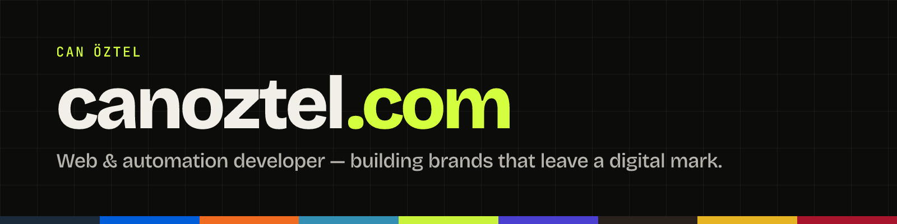

 

### Hi, I'm Can 👋

I'm a computer engineer building **websites, digital experiences and automation systems** for brands — from visual language to code, from launch to automation. Co-founder of **Gönder Gelsin**.

🌐 **[canoztel.com](https://canoztel.com)** &nbsp;·&nbsp; ✉️ [merhaba@canoztel.com](mailto:merhaba@canoztel.com) &nbsp;·&nbsp; 💼 [LinkedIn](https://www.linkedin.com/in/can-%C3%B6ztel-60b821233/) &nbsp;·&nbsp; ✍️ [Medium](https://medium.com/@canoztll)

---

### 🚀 Live work

| Project | What | Stack |
| --- | --- | --- |
| **[Meriç Grup](https://canoztel.com/en/projects/meric-grup/)** · [↗ site](https://mericgrup.com) | Corporate site with its own admin CMS | Next.js 15 · React 19 · Prisma · Neon Postgres · Cloudflare |
| **[Tarantella Pizza](https://canoztel.com/en/projects/tarantella-pizza/)** · [↗ site](https://pizzatarantella.com) | SEO-first website for a Neapolitan pizzeria | Astro · TypeScript · Schema.org · Cloudflare |
| **[Challenge Club Istanbul](https://canoztel.com/en/projects/challenge-club-istanbul/)** · [↗ site](https://challengeclubistanbul.com) | Local-SEO single-page club site | Next.js · TypeScript · Tailwind CSS |
| **[Semerkand](https://canoztel.com/en/projects/semerkand-abonelik/)** · [↗ site](https://avrupa.semerkanddijital.com.tr) | Web-based subscription platform with payments & rep panel | ASP.NET Core · EF Core · MySQL · Stripe · PayPal |

### 🛠️ In progress

- **[SeoRest](https://canoztel.com/en/projects/seorest/)** — multi-tenant, self-hosted n8n automation platform (infra as code, zero open ports)
- **[Liminal.ai](https://github.com/canoztel/liminal-ai)** — a local-first “behavior mirror” with an AI coach
- **[Film Bulucu](https://github.com/MTB-Projects/film-bulucu)** — find a film by describing a scene (semantic search)
- **[Acil Kan](https://canoztel.com/en/projects/acil-kan/)** — connecting patients in need of blood with donors (Flutter)

→ All projects: **[canoztel.com/en/projects](https://canoztel.com/en/projects/)**

---

### 🧰 Tools I use

   
   
  

### ✍️ Latest writing (Turkish · Medium)

- [Google Maps, GEO SEO ve Yapay Zekâ Çağı: Artık Sadece Google’da Çıkmak Yetmiyor](https://medium.com/@canoztll/google-maps-geo-seo-ve-yapay-zek%C3%A2-%C3%A7a%C4%9F%C4%B1-art%C4%B1k-sadece-googleda-%C3%A7%C4%B1kmak-yetmiyor-3fc5446b6ba1)
- [Üretken Yapay Zeka: Geleceği Şekillendiren Teknoloji](https://medium.com/@canoztll/%C3%BCretken-yapay-zeka-gelece%C4%9Fi-%C5%9Fekillendiren-teknoloji-cddd69fd75b5)
- [Yapay Zekâ ve İnsanlık: Bir Dönüşüm Yolculuğu](https://medium.com/@canoztll/yapay-zek%C3%A2-ve-i%CC%87nsanl%C4%B1k-bir-d%C3%B6n%C3%BC%C5%9F%C3%BCm-yolculu%C4%9Fu-0b455279e788)

---

  Got a website, automation or product idea? <a href="https://canoztel.com/en/contact/"><b>Let’s talk →</b></a>

